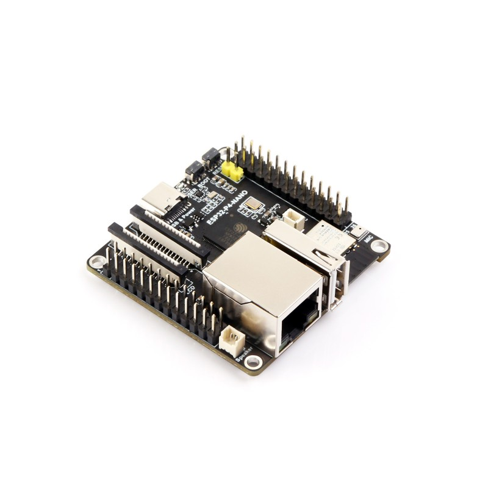
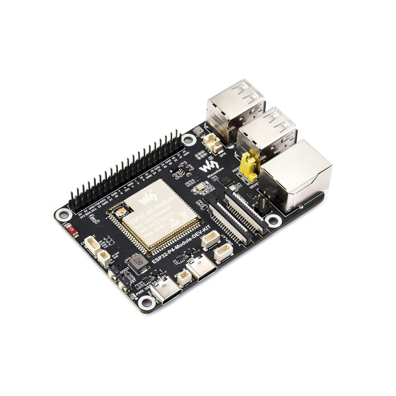
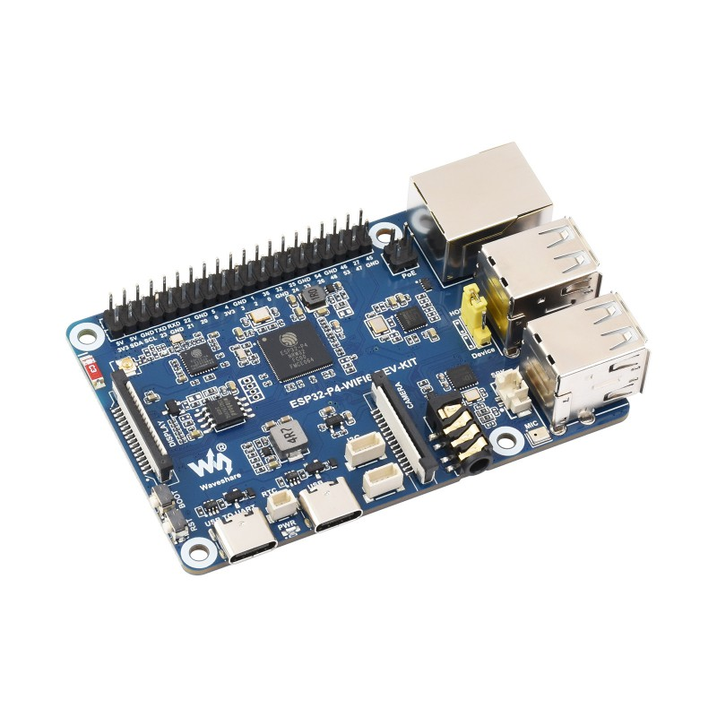
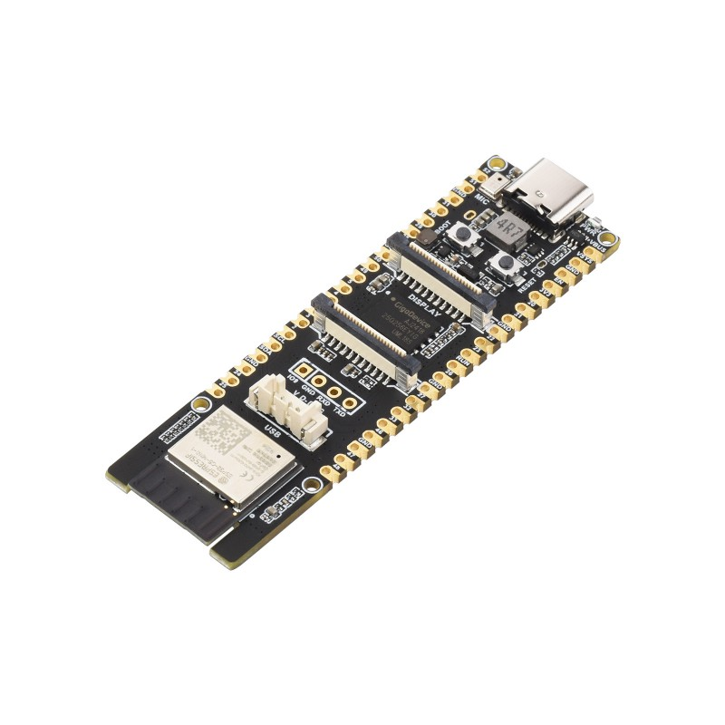
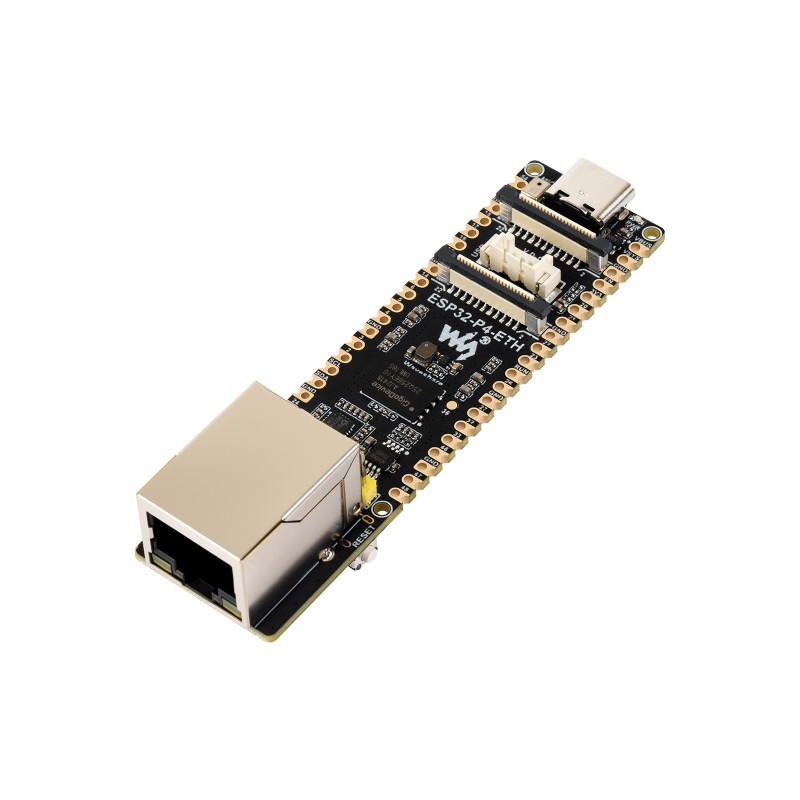
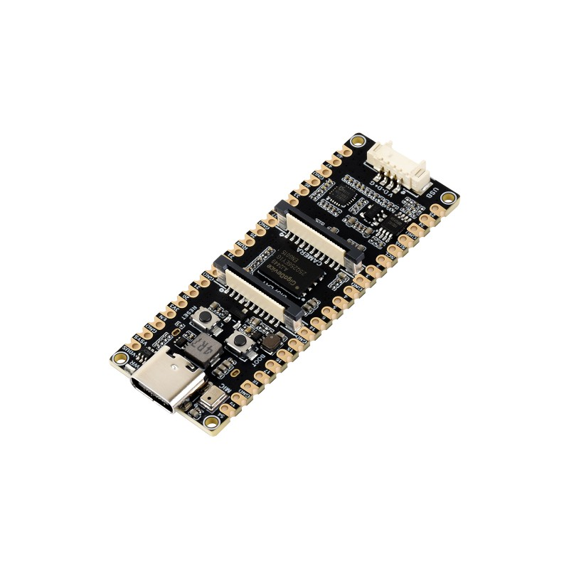
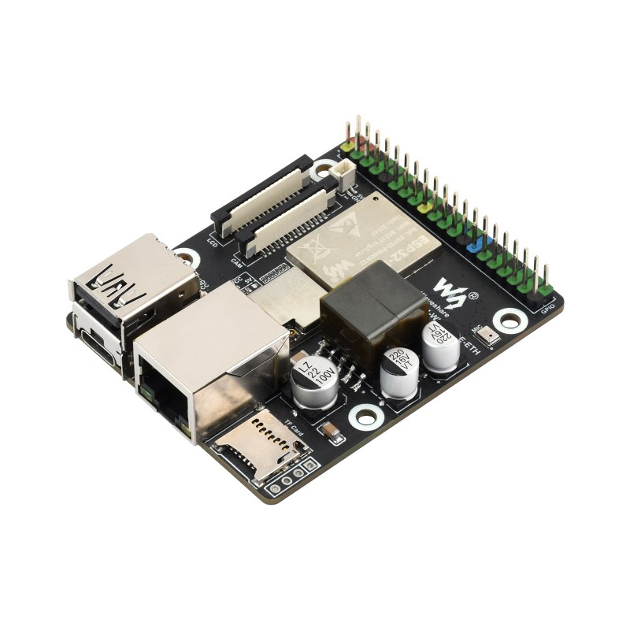
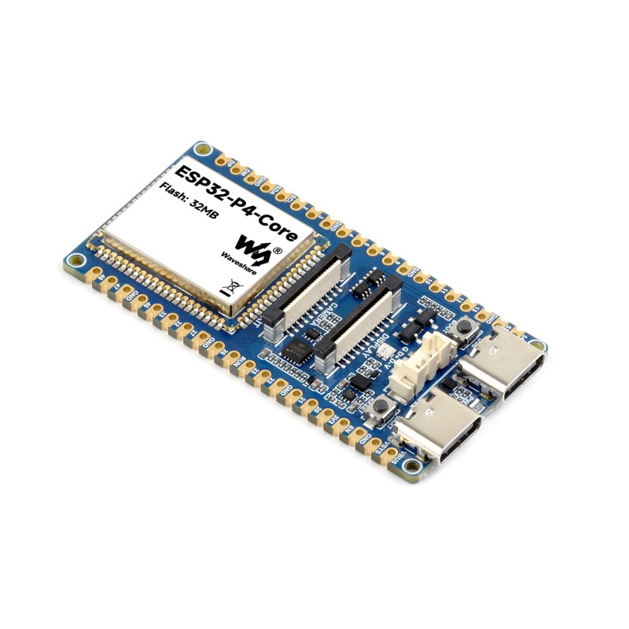

<div align="center">
  <h1>Waveshare ESP32-P4 Platform</h1>
  <p><strong>面向 Waveshare ESP32-P4 系列开发板的示例与板级调试资源</strong></p>
  <p>
    <a href="https://www.waveshare.net/shop/ESP32-P4-NANO.htm"></a>
    <a href="https://www.waveshare.net/shop/ESP32-P4-Module-DEV-KIT.htm"></a>
    <a href="https://www.waveshare.net/shop/ESP32-P4-WIFI6-DEV-KIT.htm"></a>
    <a href="https://www.waveshare.net/shop/ESP32-P4-WIFI6.htm"></a>
    <a href="https://www.waveshare.net/shop/ESP32-P4-ETH.htm"></a>
    <a href="https://www.waveshare.net/shop/ESP32-P4-Pico.htm"></a>
    <a href="https://www.waveshare.net/shop/ESP32-P4-WIFI6-POE-ETH.htm"></a>
    <a href="https://www.waveshare.net/shop/ESP32-P4-Core-DEV-KIT.htm"></a>
  </p>
  <p>
    <a href="https://github.com/waveshareteam/ESP32-P4-Platform/actions/workflows/esp-idf-examples.yml"></a>
    <a href="https://github.com/waveshareteam/ESP32-P4-Platform/actions/workflows/arduino-examples.yml"></a>
    <a href="https://github.com/waveshareteam/ESP32-P4-Platform/actions/workflows/repository-policy.yml"></a>
    <a href="LICENSE.txt"></a>
  </p>
  <p>
    <a href="README.md">English</a> ·
    <a href="https://docs.waveshare.net/ESP32-P4/">🌐 ESP32-P4 产品</a> ·
    <a href="docs/GETTING_STARTED_CN.md">📚 产品文档</a> ·
    <a href="examples/esp-idf/">🧩 ESP-IDF 示例</a> ·
    <a href="examples/arduino/README_CN.md">🔧 Arduino 示例</a>
  </p>
</div>

---

## ✨ 概述

本仓库收录 Waveshare ESP32-P4 系列开发板的第一方 ESP-IDF 和 Arduino
示例，覆盖 GPIO、I2C、Wi-Fi、以太网、SD 卡、音频编解码、显示、LVGL、
摄像头、视频流和 ESP-Brookesia UI 等常见开发场景。

本仓库同时服务多款开发板。请先在下方选择具体型号，并结合对应的官方产品文档
完成硬件接口、配件和板级配置。

[`firmware/`](firmware/) 目录同时包含 ESP-Brookesia 源码工程和预编译出厂固件包。
两者的边界请参阅[固件说明](firmware/README_CN.md)。

## 🤝 支持的开发板

点击商品图可打开产品购买页面；每款开发板下方同时提供对应的中文说明文档。

<table>
  <tr>
    <td align="center" width="25%">
      <a href="https://www.waveshare.net/shop/ESP32-P4-NANO.htm"><br><strong>ESP32-P4-NANO</strong></a><br>
      <a href="https://docs.waveshare.net/ESP32-P4-NANO/">中文文档</a>
    </td>
    <td align="center" width="25%">
      <a href="https://www.waveshare.net/shop/ESP32-P4-Module-DEV-KIT.htm"><br><strong>ESP32-P4-Module-DEV-KIT</strong></a><br>
      <a href="https://docs.waveshare.net/ESP32-P4-Module-DEV-KIT/">中文文档</a>
    </td>
    <td align="center" width="25%">
      <a href="https://www.waveshare.net/shop/ESP32-P4-WIFI6-DEV-KIT.htm"><br><strong>ESP32-P4-WIFI6-DEV-KIT</strong></a><br>
      <a href="https://docs.waveshare.net/ESP32-P4-WIFI6-DEV-KIT/">中文文档</a>
    </td>
    <td align="center" width="25%">
      <a href="https://www.waveshare.net/shop/ESP32-P4-WIFI6.htm"><br><strong>ESP32-P4-WIFI6</strong></a><br>
      <a href="https://docs.waveshare.net/ESP32-P4-WIFI6/">中文文档</a>
    </td>
  </tr>
  <tr>
    <td align="center" width="25%">
      <a href="https://www.waveshare.net/shop/ESP32-P4-ETH.htm"><br><strong>ESP32-P4-ETH</strong></a><br>
      <a href="https://docs.waveshare.net/ESP32-P4-ETH/">中文文档</a>
    </td>
    <td align="center" width="25%">
      <a href="https://www.waveshare.net/shop/ESP32-P4-Pico.htm"><br><strong>ESP32-P4-Pico</strong></a><br>
      <a href="https://docs.waveshare.net/ESP32-P4-Pico/">中文文档</a>
    </td>
    <td align="center" width="25%">
      <a href="https://www.waveshare.net/shop/ESP32-P4-WIFI6-POE-ETH.htm"><br><strong>ESP32-P4-WIFI6-POE-ETH</strong></a><br>
      <a href="https://docs.waveshare.net/ESP32-P4-WIFI6-POE-ETH/">中文文档</a>
    </td>
    <td align="center" width="25%">
      <a href="https://www.waveshare.net/shop/ESP32-P4-Core-DEV-KIT.htm"><br><strong>ESP32-P4-Core-DEV-KIT</strong></a><br>
      <a href="https://docs.waveshare.net/ESP32-P4-Core-DEV-KIT/">中文文档</a>
    </td>
  </tr>
</table>

## 🗂️ 仓库结构

| 路径 | 用途 |
| --- | --- |
| [`examples/esp-idf/`](examples/esp-idf/) | 第一方 ESP-IDF 工程 |
| [`examples/arduino/`](examples/arduino/) | 第一方 Arduino 示例和随附库 |
| [`firmware/`](firmware/) | ESP-Brookesia 源码固件与预编译出厂固件包 |
| [`assets/`](assets/) | 文档使用的产品图片 |
| [`config/`](config/) | 共享 ESP-IDF 配置覆盖文件 |
| [`docs/`](docs/) | 入门、示例、CI 和维护文档 |
| [`.github/`](.github/) | CI 工作流与贡献模板 |

如果是第一次使用本仓库，请从 [快速开始](docs/GETTING_STARTED_CN.md) 开始。
关于新增示例和文档应放置的位置，请参见
[项目结构](docs/PROJECT_STRUCTURE_CN.md)。

## 📚 文档

| 文档 | 读者 | 用途 |
| --- | --- | --- |
| [ESP32-P4 产品文档](https://docs.waveshare.net/ESP32-P4/) | 所有用户 | 官方开发板配置与硬件说明 |
| [快速开始](docs/GETTING_STARTED_CN.md) | 初学者 | 第一次构建、烧录和 monitor 工作流 |
| [示例指南](docs/EXAMPLES_GUIDE_CN.md) | 所有用户 | 按难度和外设选择示例 |
| [Arduino 指南](examples/arduino/README_CN.md) | Arduino 用户 | 板卡设置、随附库与示例索引 |
| [固件说明](firmware/README_CN.md) | 所有用户 | 源码固件与预编译出厂固件的边界 |
| [ESP32-P4 版本配置](docs/ESP32P4_REVISION_CONFIG_CN.md) | 所有用户 | 使用默认 rev3_x/v3.00+ 或显式 legacy rev1_3/pre-v3 profile |
| [故障排查](docs/TROUBLESHOOTING_CN.md) | 所有用户 | 构建、烧录、运行时和外设检查 |
| [持续集成](docs/CI_CN.md) | 贡献者 | ESP-IDF 和 Arduino 示例的 GitHub Actions 覆盖 |
| [托管组件](docs/COMPONENTS_CN.md) | 贡献者 | 依赖策略和示例本地组件分类 |
| [P4 + C6 Hosted Wi-Fi](docs/P4_C6_HOSTED_WIFI_CN.md) | 网络功能用户 | 版本通道、固件边界和运行时验证 |
| [示例路线图](docs/EXAMPLE_ROADMAP_CN.md) | 贡献者 | 可改进覆盖范围的建议示例 |
| [项目结构](docs/PROJECT_STRUCTURE_CN.md) | 贡献者 | 仓库布局和示例要求 |

## 🚀 快速开始

### ESP-IDF 示例

1. 安装[持续集成说明](docs/CI_CN.md)中列出的 ESP-IDF 版本。部分示例有额外
   版本要求，请同时阅读对应示例目录中的 README。
2. 克隆本仓库。
3. 如果你是第一次使用该开发板或本仓库，请先运行
   [00_board_check](examples/esp-idf/00_board_check/)。
4. 设置目标芯片并构建：

```bash
cd examples/esp-idf/00_board_check
idf.py set-target esp32p4
idf.py build
```

5. 默认 profile 是用于 v3.x silicon 的 `rev3_x`/`MIN_300`。包括 v1.3 在内的
   pre-v3 silicon 请显式选择带 `SELECTS_REV_LESS_V3` 的 legacy
   `rev1_3`/`MIN_100`；两个 profile 的生成 `sdkconfig` 和二进制不可复用。烧录前请阅读
   [ESP32-P4 版本配置](docs/ESP32P4_REVISION_CONFIG_CN.md)。
6. 烧录并打开 monitor，将 `PORT` 替换为你的串口：

```bash
idf.py -p PORT flash monitor
```

构建需要板级专属设置、网络凭据、显示选项、摄像头传感器或 PHY 配置的示例
前，请先运行 `idf.py menuconfig`。

### Arduino 示例

Arduino 示例位于 [examples/arduino](examples/arduino)。推荐从
[examples/arduino/README_CN.md](examples/arduino/README_CN.md) 开始，了解推荐的
Arduino-ESP32 core、随附 LVGL 版本、Arduino_GFX 版本以及 I2C driver 兼容性
说明。

## 🛠️ 工具链与 CI

| 开发框架 | 仓库覆盖范围 | CI 状态 |
| --- | --- | --- |
| ESP-IDF | [`examples/esp-idf/`](examples/esp-idf/) 下的第一方工程 | 使用 ESP-IDF `v5.5.5` 和 `v6.0.2`，目标芯片为 `esp32p4` |
| Arduino | [`examples/arduino/`](examples/arduino/) 下的第一方示例和随附库 | 使用 Arduino-ESP32 `3.3.11`、PSRAM 和默认 `ChipVariant=postv3`（v3.00+、400 MHz）编译；legacy pre-v3/v1.3 显式使用 `prev3`/360 MHz；成功构建会生成分段诊断 artifact，但仍须在 ESP32-P4 硬件上验证 |

[ESP-IDF 示例工作流](https://github.com/waveshareteam/ESP32-P4-Platform/actions/workflows/esp-idf-examples.yml)
会自动发现发生变化的工程，也支持手动选择单个示例或完整矩阵。
[Arduino 示例工作流](https://github.com/waveshareteam/ESP32-P4-Platform/actions/workflows/arduino-examples.yml)
对 9 个第一方 sketch 提供相同行为，并排除随附库内的 examples。详细说明请参阅
[持续集成](docs/CI_CN.md)。

## 🧪 示例索引

| 编号 | 示例 | 范围 |
| --- | --- | --- |
| 00 | [board_check](examples/esp-idf/00_board_check/) | 首次运行的开发板和工具链检查 |
| 01 | [HowToCreateProject](examples/esp-idf/01_HowToCreateProject/) | 最小 ESP-IDF 工程结构 |
| 02 | [HelloWorld](examples/esp-idf/02_HelloWorld/) | 基础 ESP-IDF 应用 |
| 03 | [nvs_counter](examples/esp-idf/03_nvs_counter/) | 使用 NVS 保存持久化设置 |
| 04 | [freertos_tasks](examples/esp-idf/04_freertos_tasks/) | 任务和队列 |
| 05 | [gpio_io](examples/esp-idf/05_gpio_io/) | GPIO 输入/输出 |
| 06 | [gpio_interrupt](examples/esp-idf/06_gpio_interrupt/) | GPIO 中断和消抖 |
| 07 | [uart_loopback](examples/esp-idf/07_uart_loopback/) | UART 发送/接收回环 |
| 08 | [i2c_tools](examples/esp-idf/08_i2c_tools/) | I2C 扫描和命令行工具 |
| 09 | [sdmmc](examples/esp-idf/09_sdmmc/) | SD card 和 SDMMC |
| 10 | [wifistation](examples/esp-idf/10_wifistation/) | Wi-Fi Station 连接 |
| 11 | [ethernetbasic](examples/esp-idf/11_ethernetbasic/) | Ethernet bring-up |
| 12 | [I2SCodec](examples/esp-idf/12_I2SCodec/) | I2S audio codec |
| 13 | [Displaycolorbar](examples/esp-idf/13_Displaycolorbar/) | LCD display color bar |
| 14 | [lvgl_demo_v9](examples/esp-idf/14_lvgl_demo_v9/) | LVGL v9 display demo |
| 15 | [eth2ap](examples/esp-idf/15_eth2ap/) | Ethernet-to-AP 网络 |
| 16 | [video_lcd_display](examples/esp-idf/16_video_lcd_display/) | 摄像头视频输出到 LCD |
| 17 | [simple_video_server](examples/esp-idf/17_simple_video_server/) | HTTP 摄像头流媒体 |
| 18 | [esp_brookesia_phone](examples/esp-idf/18_esp_brookesia_phone/) | ESP-Brookesia Phone UI |
| 19 | [system_monitor](examples/esp-idf/19_system_monitor/) | 串口诊断和运行时监控 |

如需更完整的 ESP-IDF 和 Arduino 示例地图，请参见
[示例总览](examples/README_CN.md) 和
[示例指南](docs/EXAMPLES_GUIDE_CN.md)。

## ✅ ESP-IDF 兼容性矩阵

图例：`✅` 表示该示例预期可在该开发板上运行。`❌` 表示示例所需外设不可用
或该示例未支持该开发板。

> [!NOTE]
> 本矩阵汇总仓库当前声明的示例支持情况。CI 仅验证编译；板级接口和硬件连接
> 请以本文上方链接的官方产品文档为准。

| 编号 | 示例 | ESP32-P4-NANO | ESP32-P4-Module-DEV-KIT | ESP32-P4-WIFI6-DEV-KIT | ESP32-P4-WIFI6 | ESP32-P4-ETH | ESP32-P4-Pico | ESP32-P4-WIFI6-POE-ETH | ESP32-P4-Core-DEV-KIT |
| --- | --- | :---: | :---: | :---: | :---: | :---: | :---: | :---: | :---: |
| 00 | [board_check](examples/esp-idf/00_board_check/) | ✅ | ✅ | ✅ | ✅ | ✅ | ✅ | ✅ | ✅ |
| 01 | [HowToCreateProject](examples/esp-idf/01_HowToCreateProject/) | ✅ | ✅ | ✅ | ✅ | ✅ | ✅ | ✅ | ✅ |
| 02 | [HelloWorld](examples/esp-idf/02_HelloWorld/) | ✅ | ✅ | ✅ | ✅ | ✅ | ✅ | ✅ | ✅ |
| 03 | [nvs_counter](examples/esp-idf/03_nvs_counter/) | ✅ | ✅ | ✅ | ✅ | ✅ | ✅ | ✅ | ✅ |
| 04 | [freertos_tasks](examples/esp-idf/04_freertos_tasks/) | ✅ | ✅ | ✅ | ✅ | ✅ | ✅ | ✅ | ✅ |
| 05 | [gpio_io](examples/esp-idf/05_gpio_io/) | ✅ | ✅ | ✅ | ✅ | ✅ | ✅ | ✅ | ✅ |
| 06 | [gpio_interrupt](examples/esp-idf/06_gpio_interrupt/) | ✅ | ✅ | ✅ | ✅ | ✅ | ✅ | ✅ | ✅ |
| 07 | [uart_loopback](examples/esp-idf/07_uart_loopback/) | ✅ | ✅ | ✅ | ✅ | ✅ | ✅ | ✅ | ✅ |
| 08 | [i2c_tools](examples/esp-idf/08_i2c_tools/) | ✅ | ✅ | ✅ | ✅ | ✅ | ✅ | ✅ | ✅ |
| 09 | [sdmmc](examples/esp-idf/09_sdmmc/) | ✅ | ✅ | ✅ | ✅ | ✅ | ✅ | ✅ | ❌ |
| 10 | [wifistation](examples/esp-idf/10_wifistation/) | ✅ | ✅ | ✅ | ✅ | ❌ | ❌ | ✅ | ❌ |
| 11 | [ethernetbasic](examples/esp-idf/11_ethernetbasic/) | ✅ | ✅ | ✅ | ❌ | ✅ | ❌ | ✅ | ❌ |
| 12 | [I2SCodec](examples/esp-idf/12_I2SCodec/) | ✅ | ✅ | ✅ | ✅ | ✅ | ✅ | ✅ | ❌ |
| 13 | [Displaycolorbar](examples/esp-idf/13_Displaycolorbar/) | ✅ | ✅ | ✅ | ✅ | ✅ | ✅ | ✅ | ✅ |
| 14 | [lvgl_demo_v9](examples/esp-idf/14_lvgl_demo_v9/) | ✅ | ✅ | ✅ | ✅ | ✅ | ✅ | ✅ | ✅ |
| 15 | [eth2ap](examples/esp-idf/15_eth2ap/) | ✅ | ✅ | ✅ | ❌ | ❌ | ❌ | ✅ | ❌ |
| 16 | [video_lcd_display](examples/esp-idf/16_video_lcd_display/) | ✅ | ✅ | ✅ | ✅ | ✅ | ✅ | ✅ | ✅ |
| 17 | [simple_video_server](examples/esp-idf/17_simple_video_server/) | ✅ | ✅ | ✅ | ✅ | ✅, Ethernet | ❌ | ✅ | ❌ |
| 18 | [esp_brookesia_phone](examples/esp-idf/18_esp_brookesia_phone/) | ✅ | ✅ | ✅ | ✅ | ✅ | ✅ | ✅ | ✅ |
| 19 | [system_monitor](examples/esp-idf/19_system_monitor/) | ✅ | ✅ | ✅ | ✅ | ✅ | ✅ | ✅ | ✅ |

## 🤝 贡献

欢迎贡献。提交 Pull Request 前，请阅读 [CONTRIBUTING_CN.md](CONTRIBUTING_CN.md)。
有价值的贡献包括：

- 修复受支持开发板上的构建问题。
- 在现有示例 README 中添加板级专属说明。
- 改进 setup 说明或 troubleshooting 说明。
- 添加目前尚未覆盖的聚焦外设示例。

报告问题时，请包含开发板名称、ESP-IDF 或 Arduino-ESP32 版本、已脱敏的串口
日志和具体示例路径。公开日志前请删除凭据、token、私有网络信息、唯一设备标识
和本地文件系统路径。

支持渠道说明请参见 [SUPPORT_CN.md](SUPPORT_CN.md)。

## 🔒 安全

不要在公开 issue 中发布漏洞细节。请使用
[安全策略](SECURITY_CN.md)中列出的实际私密报告渠道。

## 📦 第三方代码

部分示例随附第三方组件或库以方便使用，包括 LVGL、Arduino_GFX、
ESP-Brookesia 相关组件和 Espressif managed components。高层级清单请参见
[THIRD_PARTY_CN.md](THIRD_PARTY_CN.md)，并检查每个随附组件自己的许可证文件。

## 📄 许可证

本仓库基于 Apache License 2.0 授权。详情请参见 [LICENSE.txt](LICENSE.txt)。
